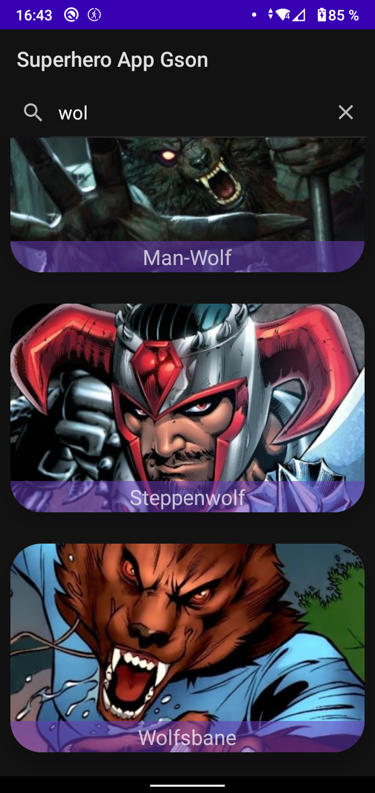
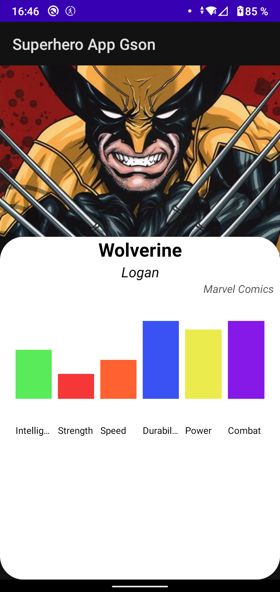

# Superheros App

Aplicación para buscar superheros y obtener un listado. También tiene una pantalla donde ves mas detallados los datos de un superheroe que te haya interesado

Elementos utilizados en esta aplicación:
* Cambios de pantallas con Intents
* Gestión, utilización y creación de recursos(string, color)
* Diseño de UI
* RangeSlider
* CardView
* Consumo de APIs con retrofit y GsonConverter
* Creación de graficos
* RecyclerViews
* Manejo de errores en caso de que no haya conexión a internet
* SearchViews
* Modularización de la app creando archivos, metodos y carpetas, favoreciendo el orden y siguiendo el principio de responsabilidad unico

|                               Pantalla principal                               |                                   Resultado                                    |
|:------------------------------------------------------------------------------:|:------------------------------------------------------------------------------:|
|    |    |